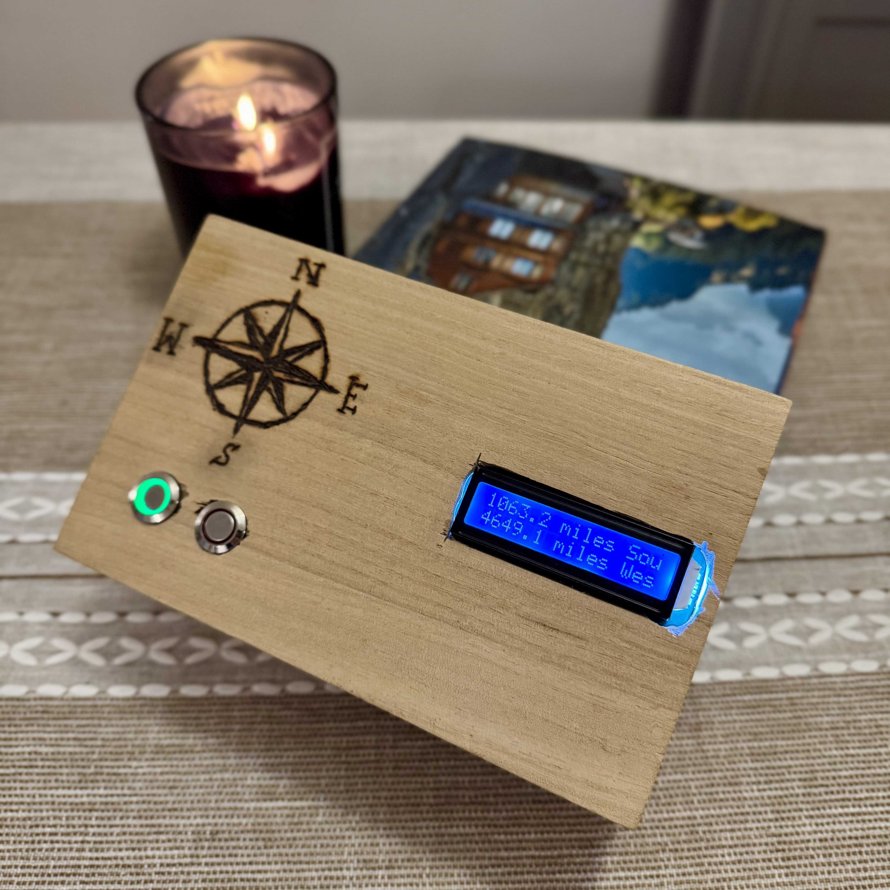
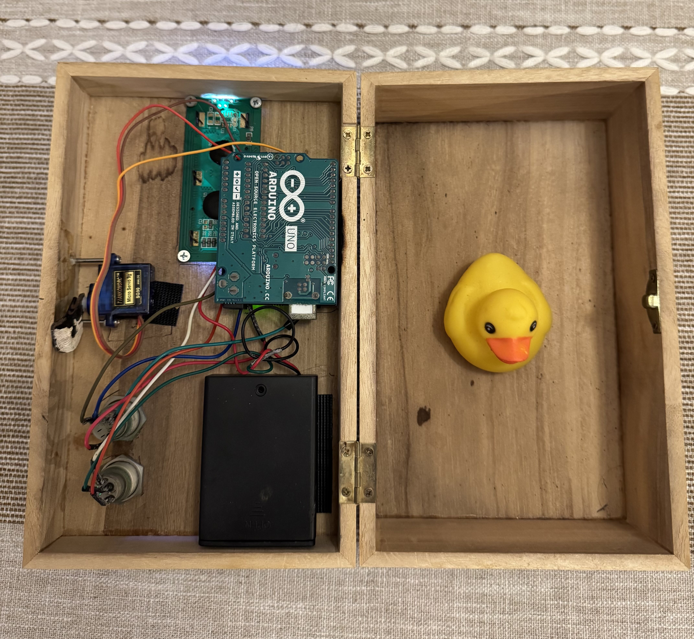

# Geo-Latch 🌎🔓

A treasure chest locks from the inside, and it will only open when you take it
to a specific but mysterious location.

This was an Arduino-based project I built when I had some free time during
COVID lockdown. I created a socially-distant scavengar hunt for my family and
friends to keep us all from going insane 😅. The `geo_latch.ino` file is an 
Arduino sketch that powered the locking mechanism of a homemade wooden box. A 
small LCD screen gave the player directions and would alert them when they were 
close.

---
## How It Worked
One or more longitude and latitude coordinates had to be hardcoded into the
`geo_latch.ino` file and uploaded to the Arduino. When the player took the
box outside, it connected to a satellite to position itself and calculate the
distance to a destination.

The LCD screen would give the player cardinal directions they needed to travel.
Once they were in a 25-yard radius of the destination, the red button would blink.
Pressing the blinking red button would disengage the lock and allow the box to open.

---
## Materials Used
- [Arduino Uno](https://docs.arduino.cc/hardware/uno-rev3/)
- [Adafruit Ultimate GPS Logger Shield](https://www.adafruit.com/product/1272)

